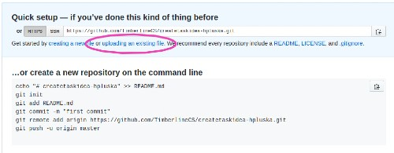
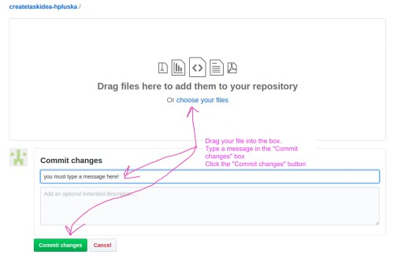

# Week 1: April 5 thru April 11

## Introduction

In this lesson you will propose an idea for your *Create Task*.  Your idea does not need to be overly complicated, just a simple program with a purpose.  Maybe a calculator that computes your GPA for both weighted and unweighted grades?  Maybe a choose your own adventure game?  Maybe a guessing game?  Maybe a matching game, or a memory game? Feel free to implement any of these ideas, or borrow from any of the labs we have completed over the course of the year to develop an idea of your own!

## Your Tasks

- [ ] Review the videos below.  These are videos of *Create Tasks* previously submitted by students just like you to college board.  Keep in mind that while these projects were likely created in other languages they could be recreated in pure javascript. Also, keep in mind that any of the programs below could earn you a "5" on the AP Exam!  What determines your score is *not* the complexity of the program, it is how well you document your program and the development process in the narrative - but, more on that later!

    * [https://www.youtube.com/watch?time_continue=14&v=9Qkyt5P4gVU&feature=emb_title](https://www.youtube.com/watch?time_continue=14&v=9Qkyt5P4gVU&feature=emb_title) 
    * [https://www.youtube.com/watch?v=nkWRj6LOjiU](https://www.youtube.com/watch?v=nkWRj6LOjiU)
    * [https://www.youtube.com/watch?time_continue=1&v=_yWDjEq6kRs&feature=emb_title](https://www.youtube.com/watch?time_continue=1&v=_yWDjEq6kRs&feature=emb_title)
    * [https://www.youtube.com/watch?v=DES53zj245w&feature=emb_title](https://www.youtube.com/watch?v=DES53zj245w&feature=emb_title)
    * [https://www.youtube.com/watch?time_continue=5&v=ptGwY2zNjRo&feature=emb_title](https://www.youtube.com/watch?time_continue=5&v=ptGwY2zNjRo&feature=emb_title)
    *  [https://www.youtube.com/watch?time_continue=36&v=QEPLXa-H_Ac&feature=emb_title](https://www.youtube.com/watch?time_continue=36&v=QEPLXa-H_Ac&feature=emb_title)
    * [https://www.youtube.com/watch?time_continue=18&v=H1iLeuNfJFM&feature=emb_title](https://www.youtube.com/watch?time_continue=18&v=H1iLeuNfJFM&feature=emb_title)

- [ ] Create a new text document.  In the document, complete the following prompts,

    *   What is your first and last name?  You must indicate this, or I cannot give you credit!   
    *   What is the name of your program
    *   What is the purpose of your program
    *   Brainstorm the steps you will take to complete your program (if you already started your program, indicated what you have completed so far and how you will complete the remainder).  This should be fairly detailed and specific - it should make sense to someone with comparable skills.  Feel free to include preliminary code in your brainstorm as well.  Keep in mind that this is just a brainstorm - you can always change course later!

- [ ] Submit your *Create Task* proposal

    *   Navigate to [http://github.com](http://github.com) and create an account
    *   Navigate to [https://classroom.github.com/a/9xe4cG4E](https://classroom.github.com/a/9xe4cG4E) to submit this assignment
        *   Accept the assignment
        *   Click on the repository link 
        
        *   Add your file 
        

